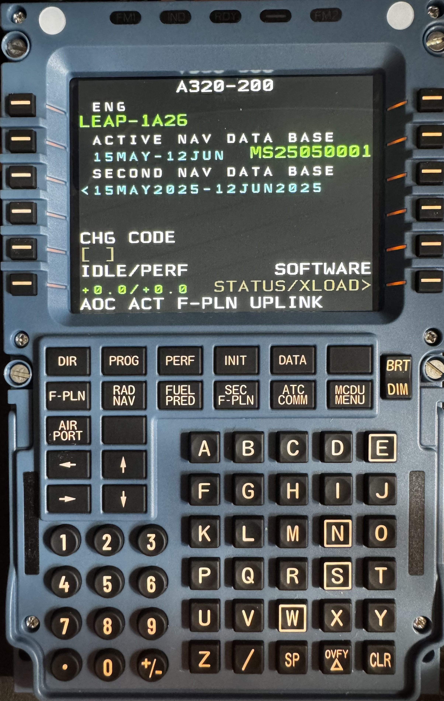

> [!NOTE]
> This project is a WIP fork of a tool originally developed for use with X-Plane and Toliss aircraft.
> This fork adapts it for Microsoft Flight Simulator 2020 (MSFS20) with FlyByWire A32NX and SimBridge for Linux.
> You do not need X-Plane for this version.


# winwing_mcdu (MSFS20 fork)

Use the Winwing MCDU on Linux with the FlyByWire Airbus A32NX in MSFS2020, using SimBridge for data integration.

Some text might not display correctly (wrong size/color), but every thing you see in the sim, should also be visible on the Winwing MCDU.

This is a fork of the original winwing_mcdu project for X-Plane, adapted for use with MSFS2020.
Credits to the original author (schenlap/memo5) for the base implementation.



## Status

The script fetches relevant data from the MCDU via SimBridge and mirrors the text output to the Winwing MCDU hardware display.


## Installation
### Debian-based systems

Clone the repository.

Copy udev rules:

    sudo cp udev/71-winwing.rules /etc/udev/rules.d/


Install dependencies with requirements file:\
```pip install -r requirements.txt```

Or via package manager:\
```sudo apt install python3-hid libhidapi-hidraw0 websocket-client```


Run the script:
```python3 ./simbridge.py```\
If it does not work, try with sudo.
On my device it needs sudo to properly access the USB device.


# Usage
1. Start MSFS2020 and load the FlyByWire A32NX.
2. Ensure SimBridge is running and correctly configured (reachable on [localhost:8380](http://localhost:8380)).\
3. Run the script as outlined above.\
4. The MCDU output will be mirrored to the hardware and console.
5. If the MCDU stays on 'Connected to Simbrige, waiting for display', check if the web version ([http://localhost:8380/interfaces/mcdu/](http://localhost:8380/interfaces/mcdu/)) does work properly.\
   5.a If web does not work, try the [troubleshooting steps](https://docs.flybywiresim.com/tools/simbridge/troubleshooting/) from FBW. Note that Linux is not officially supported.\
   5.b If web does work, see if there is any terminal output. If there are no websocket errors, feel free to create an issue with a paste from your terminal

This project is experimental. Use at your own risk.

Updates to MSFS20 or FlyByWire A32NX may break compatibility.

# Next Steps / TODO
Improve font rendering accuracy (size, color)

# Sponsoring
Support the original developer:\
\
[http://buymeacoffee.com/schenlap](http://buymeacoffee.com/schenlap)
